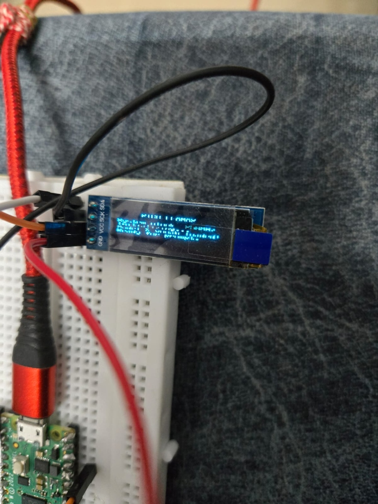

# Pico W TinyLlama Chatbot with SSD1306 OLED Display

This repository contains the source code, training scripts, and setup guides to run a custom **260K-parameter TinyLlama language model** completely offline on a **Raspberry Pi Pico W** microcontroller, with real-time response rendering on an **SSD1306 (128x32) OLED display** over I2C.

---

## 🚀 Key Features & Highlights

1. **On-Device Offline Inference**: Runs fully standalone on the Pico W's RP2040 chip (Dual ARM Cortex-M0+ @ 133MHz, 264KB SRAM).
2. **Double Context Length (256 Tokens) via GQA**: Configured with Grouped Query Attention (`n_kv_heads=2` instead of 4) to support a 256-token context window without exceeding the Pico's SRAM limits.
3. **SSD1306 (128x32) Screen Integration**: Auto-wrapped serial console printing that streams model tokens straight to a physical OLED screen.
4. **Teacher-Agent Self-Training Loop**: An automated training script (`train_in_loop.py`) that uses a local `gemma4:31b-cloud` model on Ollama to automatically synthesize data, evaluate student answers, and generate corrective samples on failures.
5. **GPU Acceleration**: CUDA-accelerated PyTorch training pipeline on the host machine to complete full distillation training under 5 minutes.

---

## 🛠️ Hardware Setup

### Wiring Diagram

Connect your **SSD1306 128x32 OLED Display** to the **Raspberry Pi Pico W** as follows:



| SSD1306 Pin | Pico W GPIO Pin | Notes |
| :--- | :--- | :--- |
| **GND** | GND (Pin 38 / Any GND) | Ground reference |
| **VCC** | 3V3 (Pin 36) | Power input (3.3V) |
| **SDA** | GPIO 0 (Pin 1) | I2C Data Line (I2C0 SDA) |
| **SCK / SCL** | GPIO 1 (Pin 2) | I2C Clock Line (I2C0 SCL) |

---

## 📦 Project Structure

```
picoW-AI/
└── weights/
    ├── chatbot.bin            # Trained student weights in binary format
    ├── tok512.bin             # Tokenizer vocabulary file (512 tokens)
    └── SLM/                   # Pico firmware project folder
        ├── SLM.cpp            # Main C++ firmware, inference engine & screen driver
        ├── train_in_loop.py   # Closed-loop teacher-student distillation script
        ├── model_weights.h    # C array header of weights compiled directly into flash
        ├── CMakeLists.txt     # Pico SDK build config
        ├── README.md          # This main guide
        └── TRAINING_GUIDE.md  # Detailed training methodology and architecture guide
```

---

## ⚙️ Host & Inference Setup

### 1. Prerequisites (Host Machine)
Ensure you have the following installed on your PC:
* **Python 3.10+**
* **NVIDIA Driver + CUDA Toolkit** (for GPU training speed)
* **Ollama** with the `gemma4:31b-cloud` model pulled (`ollama pull gemma4:31b-cloud`)
* **CMake** & **GCC ARM Embedded Toolchain** (for compiling the C++ firmware)

### 2. Python Environment Setup
Install PyTorch with CUDA 12.1 and dependencies:
```powershell
python -m pip install torch --index-url https://download.pytorch.org/whl/cu121 --force-reinstall
pip install requests numpy
```

### 3. Run Self-Training
Launch the automated distillation pipeline:
```powershell
python train_in_loop.py
```
This runs the iterative learning loops, validates model behaviors, and exports `chatbot.bin` and `model_weights.h`.

---

## 🔨 Compiling & Flashing the Pico W

1. Navigate to the C++ project folder:
   ```powershell
   cd D:\Coding\picoW-AI\weights\SLM
   ```
2. Initialize and build the project:
   ```powershell
   cmake -B build -G Ninja
   cmake --build build
   ```
3. Boot the Pico W in bootloader mode (hold the `BOOTSEL` button while plugging in the USB cable).
4. Copy the compiled `build/SLM.uf2` file and drop it onto the mounted `RPI-RP2` drive.

---

## 💬 Interacting with the Chatbot

You can interact with the Pico W CLI directly from your host terminal using our custom interactive client script:

```powershell
python pico_terminal.py
```

This script auto-detects your Pico W COM port, opens the connection, and forwards character inputs in real-time (similar to PuTTY).

### Alternative: Using PuTTY or Arduino Serial Monitor
Alternatively, you can open any external serial monitor at **115200 baudrate** to start chatting:

```
--- Pico Llama CLI ---
1. Run Generate Mode (Storytelling)
2. Run Chat Mode (Interactive dialog)
3. Configure hyperparameters (temp=1.00, top-p=0.90, steps=256)
Choose option (1-3): 2

Starting Chat Session. Press Enter on an empty line to exit.
User: hello, how are you
Assistant: Hello! I am doing well, thank you! How are you doing? I hope everything is going great with you.
```
*Note: The OLED screen will simultaneously display the prompt status and stream output tokens in real-time.*

For more details on the training methodology, model architecture, and design decisions, please read the [TRAINING_GUIDE.md](file:///D:/Coding/picoW-AI/weights/SLM/TRAINING_GUIDE.md).
